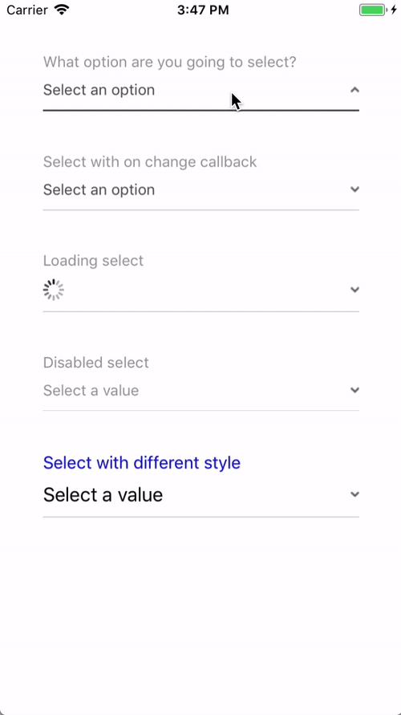
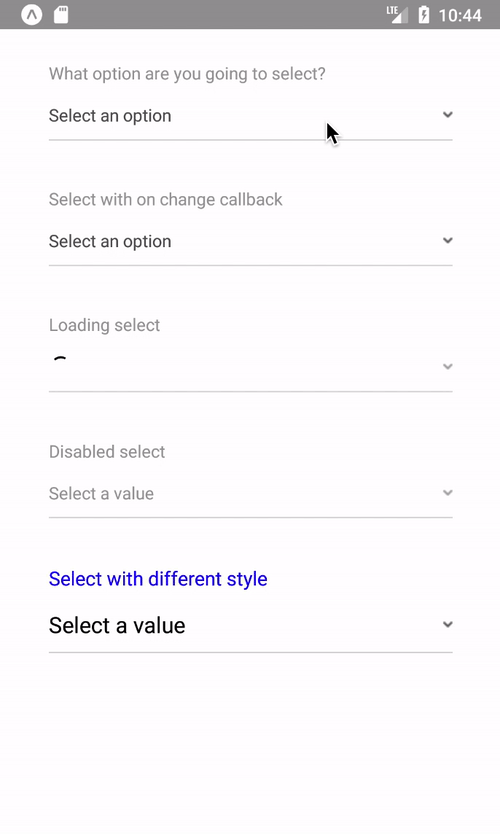

<h1 align="center">react-native-select-input</h1>
<p align="center">
  Easy-peasy select input picker for React Native.
</p>

<p align="center">
  <a href="https://travis-ci.org/Tele2-NL/react-native-select-input"></a>
  <a href="https://github.com/Tele2-NL/react-native-select-input/issues"></a>
</p>

## Demo

iOS | Android
:--- | :---
|

> You can try the [demo app here].

## Usage

```jsx
import React, { Component } from 'react';
import SelectInput from '@tele2/react-native-select-input';

class MyComponent extends Component {
  render() {
    <SelectInput
      options={[{
        value: 'my-option-value',
        label: 'My option label',
      }]}
    />
  }
}

export default MyComponent;
```

> You can see more examples in the [example app].

## API

Property | Type | Required | Default value | Description
:--- | :--- | :--- | :--- | :---
label|string|no|null|Label to be shown on the top of the input.
placeholder|string|no|string|Placeholder to be shown if the input has no value.
done|string|no|string|String that shows on the header of the select input in iOS.
value|string/number|no|null|Current input value.
options|arrayOf|yes|[Check here][options]|Options available to be selected.
disabled|bool|no|false|Whether the input is disabled or not.
loading|bool|no|false|Whether the input is on loading state or not.
colors|shape|no|[Check here][colors]|Colors to easily personalize the input.
onChange|function|no|null|Function to be called whenever the input value is changed.
renderLabel|function|no|null|Function to render a custom label.
renderArrowIcon|function|no|null|Function to render a custom arrow icon.
labelStyle|custom|no|null|Custom label style.
valueStyle|custom|no|null|Custom value style.
containerStyle|custom|no|null|Custom style for the container of the input.
innerContainerStyle|custom|no|null|Custom style for the inner container of the input.
arrowIcon||no|null|

## License
MIT © [Tele2 Netherlands].

[demo app here]: https://expo.io/@lucasbento/react-native-select-input-example
[example app]: https://github.com/Tele2-NL/react-native-select-input/tree/master/example
[options]: https://github.com/lucasbento/react-native-select-input/blob/92f27b23adc9fb768b58a84ab6c043e55b4d89ef/src/SelectInput.js#L37-L48
[colors]: https://github.com/lucasbento/react-native-select-input/blob/92f27b23adc9fb768b58a84ab6c043e55b4d89ef/src/SelectInput.js#L57-L64
[Tele2 Netherlands]: https://github.com/Tele2-NL